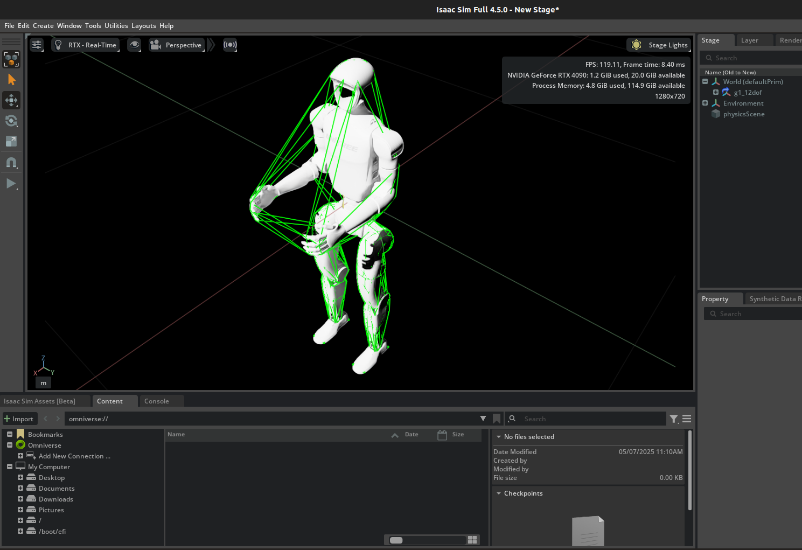

# Converting URDF to USD
Follow these instructions to convert a URDF file to a Universal Scene Description (USD) to be compatible with IssacSim/Lab enviornments. To start, use this IssacSim tutorial to convert the URDF:
```https://docs.isaacsim.omniverse.nvidia.com/latest/robot_setup/import_urdf.html```.

Here is an example of what you may see after converting and viewing in IssacSim.


